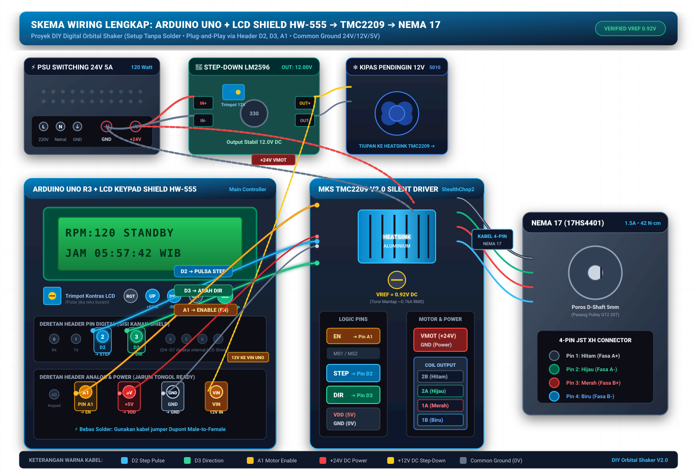

# DIY Digital Orbital Shaker (Pro Edition)

Proyek rancang bangun **DIY Digital Orbital Shaker** laboratorium mandiri dengan meja kerja $25 \times 30\text{ cm}$, kapasitas beban cairan hingga 1.5 kg, rentang kecepatan 30 – 300 RPM, penggerak motor stepper ultra-hening (TMC2209 *StealthChop2*), serta kendali presisi Arduino Uno dengan tampilan jam digital *real-time*.



---

## 📋 Spesifikasi Sistem & Hardware

| Parameter | Spesifikasi |
| :--- | :--- |
| **Dimensi Platform** | $250 \times 300\text{ mm}$ (Akrilik 4–5 mm / Plat Aluminium) |
| **Kapasitas Beban** | s.d. 1.5 kg (botol kultur, erlenmeyer, bejana kimia) |
| **Rentang Kecepatan** | **30 – 300 RPM** (dapat diatur dengan kelipatan 5 RPM) |
| **Tipe Gerakan** | *Pure Orbital Circular Translation* (Radius orbit $r = 10\text{ mm}$, stroke $\varnothing 20\text{ mm}$) |
| **Sistem Penyeimbang** | Counterweight $180^\circ$ dinamis untuk meredam gaya sentrifugal cairan |
| **Motor Penggerak** | NEMA 17 Stepper Motor ($1.8^\circ$/step, 17HS4401, 1.5A, Torsi $\sim 42\text{ N}\cdot\text{cm}$) |
| **Driver Stepper** | MKS TMC2209 V2.0 / V1.3 (*StealthChop2*, Vref disetel $\sim 0.90\text{V} - 1.05\text{V}$) |
| **Catu Daya (PSU)** | Switching PSU 24V 5A (120W) |
| **Manajemen Daya** | Step-Down LM2596 (24V $\rightarrow$ 12V untuk Kipas 5010 & Arduino VIN) |
| **Mikrokontroler** | Arduino Uno R3 (ATmega328P @ 16 MHz) |
| **Antarmuka Pengguna** | LCD 1602 Keypad Shield HW-555 / LCD I2C 1602 + Rotary Encoder KY-040 + Keypad Matriks 4x4 |
| **Fitur Firmware** | S-Curve Ramp-Up/Down (2s ramp), Continuous Mode, Timer Mode, Real-Time Clock, EEPROM Storage |

---

## 🗂️ Struktur Direktori Repositori

```text
.
├── Arduino code/
│   ├── orbital_shaker/
│   │   ├── orbital_shaker.ino     # Firmware utama Arduino Uno
│   │   ├── config.h               # Konfigurasi pinout, rasio puli, limit RPM & EEPROM
│   │   └── sketch.yaml            # Profil build Arduino CLI (FQBN: arduino:avr:uno)
│   ├── README.md                  # Panduan navigasi menu & kontrol firmware
│   └── WIRING_DIAGRAM.md          # Dokumentasi pinout dan skema pengkabelan
├── multimeter/
│   ├── README.md                  # Panduan pengukuran multimeter & tuning Vref TMC2209
│   └── CONTEXT.md                 # Domain context kalibrasi multimeter
├── scripts/
│   ├── setup_deps.sh              # Script instalasi core & library via Arduino CLI
│   ├── compile.sh                 # Script kompilasi firmware otomatis
│   ├── upload.sh                  # Script upload firmware ke Arduino
│   └── monitor.sh                 # Script serial monitor (115200 baud)
├── arduino-cli.yaml               # Konfigurasi workspace Arduino CLI
├── Makefile                       # Target kompilasi dan upload cepat
├── CONTEXT.md                     # Glosarium konsep domain & keputusan arsitektur
├── daftar_belanja.html            # Bill of Materials (BOM) & daftar komponen
├── Langkah_Kerja_Perakitan_Orbital_Shaker.html # SOP panduan perakitan & kalibrasi lengkap
├── Langkah_Kerja_Perakitan_Orbital_Shaker.pdf  # Versi PDF SOP perakitan
└── wiring_diagram.svg             # Diagram skematik visual perkabelan
```

---

## ⚡ Panduan Arduino CLI

Proyek ini telah dikonfigurasi penuh agar dapat dikompilasi dan di-*upload* langsung melalui **Arduino CLI**.

### 1. Prasyarat Instalasi Arduino CLI

Jika belum terpasang di sistem Linux:
```bash
curl -fsSL https://raw.githubusercontent.com/arduino/arduino-cli/master/install.sh | sh
# Tambahkan arduino-cli ke PATH Anda (misal ~/.local/bin)
```

### 2. Menginstal Core & Library Dependencies

Jalankan skrip pembantu atau perintah Arduino CLI berikut:
```bash
./scripts/setup_deps.sh
```
*Atau secara manual:*
```bash
arduino-cli core update-index
arduino-cli core install arduino:avr
arduino-cli lib install "LiquidCrystal"
arduino-cli lib install "LiquidCrystal I2C"
arduino-cli lib install "Keypad"
arduino-cli lib install "AccelStepper"
```

### 3. Mengompilasi Firmware (Build)

Karena sudah terdapat `sketch.yaml` di dalam folder sketch, Anda cukup menjalankan:
```bash
./scripts/compile.sh
```
*Atau perintah langsung:*
```bash
arduino-cli compile "Arduino code/orbital_shaker"
```

### 4. Meng-upload ke Arduino Board

Deteksi port Arduino yang terhubung:
```bash
arduino-cli board list
```
Lalu lakukan upload (ganti `/dev/ttyACM0` atau `/dev/ttyUSB0` sesuai port Anda):
```bash
./scripts/upload.sh /dev/ttyACM0
```
*Atau perintah langsung:*
```bash
arduino-cli upload -p /dev/ttyACM0 --fqbn arduino:avr:uno "Arduino code/orbital_shaker"
```

### 5. Membuka Serial Monitor

Untuk memonitor status atau melakukan sinkronisasi jam digital via serial:
```bash
./scripts/monitor.sh /dev/ttyACM0 115200
```

---

## 🕹️ Panduan Pengoperasian Firmware

### 1. Tampilan LCD 1602
- **Layar Standby (IDLE)**: Menampilkan target RPM yang disetel dan jam digital *real-time* (`JAM  06:45:28WIB`).
- **Layar Running**:
  - *Mode Timer*: Menampilkan RPM aktual/target, status running, jam terkini, dan sisa waktu hitung mundur (`06:45 |TMR 14:30`).
  - *Mode Continuous*: Menampilkan durasi berjalan sejak dimulai (`06:45 |RUN 05:20`).

### 2. Pengaturan Jam Digital (Real-Time Clock)
- **Melalui Keypad**: Saat kondisi STANDBY, tekan tombol **`D`**, ketik 2 digit jam (0–23) lalu tekan **`#`**, ketik 2 digit menit (0–59) lalu tekan **`#`**.
- **Melalui Serial Monitor**: Kirim string format waktu: `TIME=07:30:00`.

### 3. Kontrol Tombol & Rotary Encoder
- **Rotary Encoder KY-040**:
  - Putar Kiri / Kanan: Menurunkan / Menaikkan RPM (kelipatan 5 RPM).
  - Tekan Cepat: Toggle **START** / **STOP**.
  - Tekan & Tahan (> 0.8s): Toggle Mode (**Continuous** $\leftrightarrow$ **Timer**).
- **Keypad Matriks 4x4 / Shield Button**:
  - `A`: Ganti Mode (Continuous / Timer).
  - `B`: Set Durasi Timer (Menit).
  - `C`: START / RESUME.
  - `D`: STOP / Set Jam saat Standby.
  - `*`: Quick input RPM.
  - `#`: Konfirmasi / Toggle Start-Stop.

---

## 🛡️ Keselamatan & Tuning Elektrik

1. **Vref TMC2209**: Pastikan tegangan Vref potensiometer TMC2209 diukur terhadap GND sebelum motor dipasang. Untuk NEMA 17 (1.5A peak), set Vref pada rentang **0.90V – 1.05V** ($I_{RMS} \approx 0.64\text{A} - 0.74\text{A}$) untuk torsi optimal tanpa panas berlebih.
2. **Pendinginan Aktif**: Kipas 12V 5010 wajib aktif meniup heatsink TMC2209 saat sistem menyala.
3. **Common Ground**: Seluruh ground (GND PSU 24V, GND Step-down LM2596, GND Arduino Uno, GND TMC2209) wajib terhubung bersama (*Star Grounding*).

---

## 📜 Lisensi & Dokumentasi

Dokumentasi langkah perakitan mekanik dan kalibrasi lengkap dapat dilihat pada [Langkah Kerja Perakitan Orbital Shaker](Langkah_Kerja_Perakitan_Orbital_Shaker.html).
