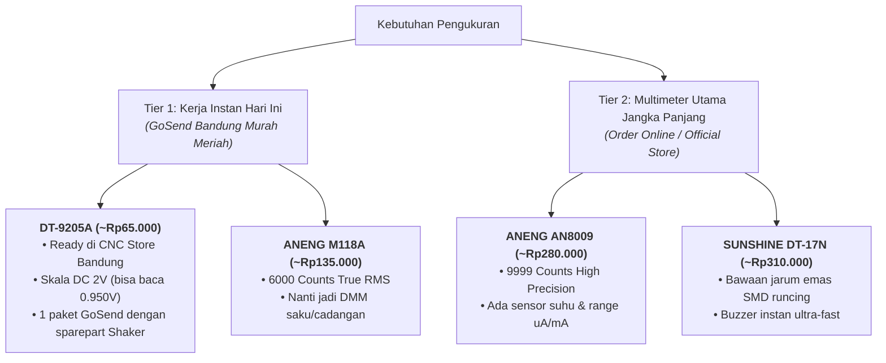

# 🎛️ Panduan Pemilihan & Riset Pasar Multimeter Digital

Dokumentasi lengkap hasil riset pasar, analisis teknis, evaluasi titik buta (*adversarial critique*), dan strategi pemilihan multimeter digital untuk proyek **DIY Orbital Shaker**, kalibrasi elektronika presisi (Vref TMC2209 & Step-Down LM2596), modul Edge AI / LLM (Gemma), serta kelistrikan rumah tangga (AC 220V).

---

## 📌 Daftar Isi
1. [Latar Belakang & Profil Penggunaan](#1-latar-belakang--profil-penggunaan)
2. [Strategi Dua Tingkat (Two-Tier Multimeter Strategy)](#2-strategi-dua-tingkat-two-tier-multimeter-strategy)
3. [Tabel Komparasi Head-to-Head](#3-tabel-komparasi-head-to-head)
4. [Hasil Survei Pasar & Ketersediaan Toko di Bandung](#4-hasil-survei-pasar--ketersediaan-toko-di-bandung)
5. [Analisis Titik Buta & Evaluasi Kritis (Adversarial Critique)](#5-analisis-titik-buta--evaluasi-kritis-adversarial-critique)
6. [SOP Penggunaan Multimeter pada Proyek](#6-sop-penggunaan-multimeter-pada-proyek)

---

## 1. Latar Belakang & Profil Penggunaan

### Kebutuhan Pengukuran Utama (90–95% Beban Kerja)
* **Kalibrasi Tegangan Referensi Stepper Driver (`Vref` TMC2209)**: Mengukur tegangan DC orde rendah $\approx 0.90\text{V} - 1.10\text{V}$ dengan resolusi milivolt ($\pm 1\text{ mV}$) pada trimpot SMD yang sangat sempit.
* **Kalibrasi Modul DC-DC Step-Down (LM2596)**: Menyetel output dari 24V menjadi persis **12.0V** sebelum disambungkan ke pin `VIN` Arduino Uno dan Kipas DC 12V 5010.
* **Uji Kontinuitas Jalur & Motor Stepper**: Mengidentifikasi pasangan lilitan fasa motor NEMA 17 (Coil Phase A vs Coil Phase B, resistansi $\approx 2 - 4\,\Omega$) dan mendeteksi kabel *jumper* longgar.
* **Pengembangan Modul Edge AI / LLM (Gemma)**: Mengukur stabilitas jalur tegangan DC (5V, 3.3V, 1.8V, 0.8V), memantau konsumsi arus ($\mu\text{A}$ saat *standby* hingga $3\text{A} - 5\text{A}$ saat *prompt processing*), dan suhu *heatsink* SoC/NPU.

### Kebutuhan Pengukuran Sekunder (5–10% Beban Kerja)
* **Kelistrikan Rumah Tangga AC 220V**: Pengecekan stopkontak PLN, verifikasi input AC ke PSU Switching Jaring 24V 5A, dan deteksi kebocoran arus (*chassis grounding / nyetrum*).

---

## 2. Strategi Dua Tingkat (Two-Tier Multimeter Strategy)

Pendekatan paling rasional dan efisien untuk kebutuhan instan hari ini dan investasi jangka panjang:

---

## 3. Tabel Komparasi Head-to-Head

| Model Multimeter | Counts & RMS | Kontrol | Sumber Daya | Probe Bawaan | Sensor Suhu | Proteksi AC 220V | Estimasi Harga | Karakter Utama |
| :--- | :--- | :--- | :--- | :--- | :--- | :--- | :--- | :--- |
| **ANENG AN8009** | 9.999 True-RMS | Knob Putar | 2x AAA | Standar | ✅ Ada (K-Type) | ⭐⭐⭐ | Rp270k – Rp320k | **Presisi DC Tertinggi (4 Digit mV)** |
| **SUNSHINE DT-17N** | 6.000 True-RMS | Knob Putar | 1x 9V / 2x AAA | **Jarum Emas SMD** | ✅ Ada | ⭐⭐⭐ | Rp290k – Rp340k | **Favorit Workbench & Buzzer Instan** |
| **UNI-T UT136B+** | 4.000 True-RMS | Knob Putar | 2x AA | Tebal Standar | ❌ Tidak | ⭐⭐⭐⭐⭐ (CAT III) | Rp360k – Rp420k | **Keamanan AC & Durabilitas Badak** |
| **DELIXI 8237B** | 6.000 True-RMS | Knob Putar | 2x AAA | Standar | ❌ Tidak | ⭐⭐⭐⭐ | Rp270k – Rp310k | **Standar Industri (Ready di CNC Store)** |
| **ANENG 682 Pro** | 6.000 True-RMS | Smart Touch | **Cas Type-C** | Standar Silikon | ✅ Ada | ⭐⭐⭐ | Rp280k – Rp360k | **Layar HP Besar & Bebas Beli Baterai** |
| **ANENG M118A** | 6.000 True-RMS | Smart Auto | 2x AAA | Standar | ❌ Tidak | ⭐⭐⭐ | Rp125k – Rp155k | **Best Budget Saku True-RMS** |
| **DT-9205A** | 1.999 Non-RMS | Knob Putar | 1x 9V | Standar | ❌ Tidak | ⭐⭐ | Rp55k – Rp75k | **Darurat Hari Ini (~Rp60rb-an)** |

---

## 4. Hasil Survei Pasar & Ketersediaan Toko di Bandung

### A. Toko Ready Stock Bandung (Kurir Instan GoSend / Grab)

1. **CNC Store Bandung** *(Panyileukan / Soekarno-Hatta)*:
   - **Produk**: `DELIXI 8237B` (~Rp280k), `DT-9205A` (~Rp65k), `BSIDE S11` (~Rp350k).
   - **Aksesori**: `Kabel Probe Jarum Runcing 20A 1000V` (~Rp15k).
   - **Keunggulan**: Bisa digabung 1 paket GoSend dengan sparepart Shaker (Bearing 608ZZ, Pulley 2GT, Terminal Block KF301, Kabel AWG 22).
2. **Juragan Perkakas Bandung** *(Astanaanyar)*:
   - **Produk**: `ANENG M118A` (~Rp135k), `ANENG SZ301/SZ304`.
3. **Toserba Bandung Onlineshop** *(Bandung Kulon / Sukasari)*:
   - **Produk**: `ANENG A3008`, `ANENG 620A/622A`, `ANENG SZ02`, `ANENG DM850`.
4. **Toko Servis HP & Elektronik Bandung** *(Banceuy / Astana Anyar / SP Tech / Kurina88)*:
   - **Produk**: `SUNSHINE DT-17N` (~Rp310k), `SUNSHINE DT-19N` (~Rp260k), `ZOYI ZT102` (~Rp240k).
5. **O- Olshop Bandung / DW Store Online** *(Batununggal / Dayeuhkolot)*:
   - **Produk**: `ANENG AN8008 / AN8009` (~Rp280k - Rp320k).

---

## 5. Analisis Titik Buta & Evaluasi Kritis (*Adversarial Critique*)

### ⚠️ Realitas Teknis & Trade-Offs

1. **Dilema Probe Bawaan**:
   - **Probe Tumpul Industri (UNI-T / Delixi)**: Sangat aman untuk colokan 220V rumah tangga, namun **sangat berbahaya** saat menyentuh baut trimpot TMC2209 karena mudah tergelincir (*slip*) dan men-short jalur $24\text{V}$ ke $3.3\text{V}$ logic (driver langsung hangus).
   - **Probe Jarum Runcing Emas (Sunshine)**: Sangat nyaman untuk PCB mikro SMD, namun **tidak boleh** ditusukkan serampangan ke stopkontak dinding AC 220V karena rawan bengkok dan insulasi proteksi jarum lebih pendek.
   - **Solusi Bijaksana**: Gunakan probe bawaan untuk AC 220V, dan pasang **Needle Probe Tambahan (Rp15.000)** saat bekerja di papan sirkuit DC.

2. **Kelemahan Tipe Smart Auto-Detect (M118A / 682 Pro)**:
   - Tipe *Smart Auto* tidak memiliki knob manual, sehingga prosesor membutuhkan waktu deteksi $\approx 0.8 - 1.5\text{ detik}$ (*hunting delay*) setiap kali probe berpindah titik ukur. Untuk pengetesan jalur kontinu secara cepat, knob putar manual (seperti AN8009 / Sunshine / DT-9205A) jauh lebih responsif.

---

## 6. SOP Penggunaan Multimeter pada Proyek

### A. Prosedur Kalibrasi `Vref` Driver TMC2209 (Target: $0.95\text{V} - 1.05\text{V}$)
1. Pasang CNC Shield V3 ke Arduino Uno (atau letakkan driver pada soket dengan jalur `GND` dan `VMOT 24V` terhubung).
2. Nyalakan Power Supply 24V (Pastikan tegangan masuk ke pin `VMOT`).
3. Setel Multimeter ke mode **DC Voltage ($V_{=}$)** pada skala $2\text{V}$ atau Auto-Range.
4. Hubungkan **Probe Hitam (COM)** ke `GND` power supply / terminal block.
5. Tempelkan **Probe Merah (Jarum Runcing)** ke kepala obeng kecil / test pad trimpot `Vref` TMC2209.
6. Putar trimpot perlahan menggunakan obeng keramik / obeng minus kecil hingga display multimeter menunjukkan nilai:
   $$V_{\text{ref}} = \frac{I_{\text{rms}} \times 2.5}{1.77} \approx 0.95\,\text{V} - 1.05\,\text{V}$$
   *(Untuk motor 17HS4401 arus target $I_{\text{rms}} \approx 0.7\text{A} - 0.8\text{A}$ agar motor dingin).*

### B. Prosedur Kalibrasi Step-Down LM2596 (Target: $12.0\text{V}$)
1. Hubungkan input LM2596 (`IN+` dan `IN-`) ke jalur PSU 24V.
2. **JANGAN SAMBUNGKAN** output LM2596 ke Arduino / Kipas terlebih dahulu.
3. Setel Multimeter ke mode **DC Voltage ($V_{=}$)** skala $20\text{V}$ atau Auto.
4. Hubungkan probe multimeter ke terminal `OUT+` (Merah) dan `OUT-` (Hitam).
5. Putar baut trimpot kuningan multiturn pada LM2596 berlawanan arah jarum jam (biasanya 5–10 putaran) hingga tegangan turun dari 24V ke **12.00V**.
6. Matikan PSU, baru sambungkan output 12V ke Kipas 5010 dan pin `VIN` Arduino Uno.

### C. Prosedur Cek Kelistrikan AC 220V Rumah
1. **Aturan Wajib**: Pastikan probe merah tertancap di colokan jack **`V/Ω/Hz`** (DILARANG di colokan `A` atau `mA/uA`).
2. Putar knob selektor ke mode **`V~` (AC Voltage)**.
3. Pegang bagian gagang plastik di belakang pembatas jari (*finger guard*).
4. Masukkan kedua ujung probe ke lubang stopkontak dinding untuk memastikan tegangan $\approx 210\text{V} - 230\text{V AC}$.
